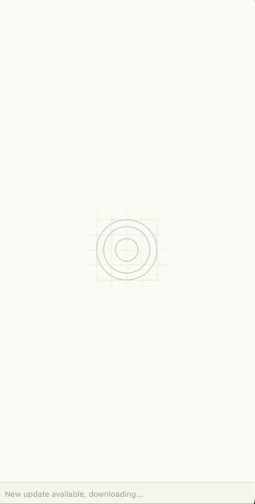
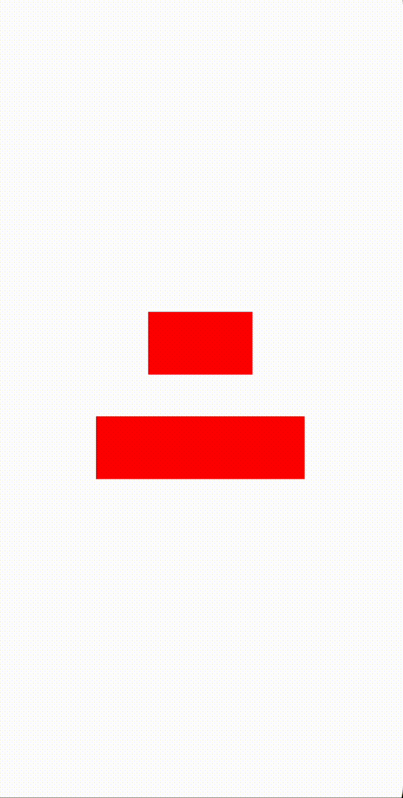
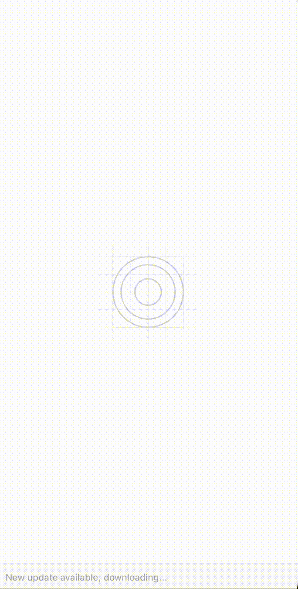

# React Native Dynamic Skeletons
[](https://badge.fury.io/js/react-native-dynamic-skeletons)





React Native Dynamic Skeletons is an easy, customizable, and dynamic solution to create beautiful loading experiences in your React Native apps.

This library provides a simple and intuitive way to create dynamic skeletons that mimic the appearance of your app's content.

The skeletons can be easily customized to match your app's design, and the library provides a wide range of options to create dynamic and engaging loading experiences.

Developed in Typescript, this library is fully compatible with both iOS and Android. And it's also compatible with Expo.

This library does not use any third-party dependencies, and it's fully customizable.

You decide how the skeleton should look like. By providing a custom component, you can create skeletons that match your app's design.

You can use react-native-linear-gradient, expo-linear-gradient, react-native-skia or any other library.

## Table of Contents
- [React Native Dynamic Skeletons](#react-native-dynamic-skeletons)
  - [Table of Contents](#table-of-contents)
  - [Installation](#installation)
  - [Usage](#usage)
  - [Props](#props)
  - [Animation Types](#animation-types)
    - [Left to Right](#left-to-right)
    - [Right to Left](#right-to-left)
    - [Top to Bottom](#top-to-bottom)
    - [Bottom to Top](#bottom-to-top)


## Installation


```bash
  npm install react-native-dynamic-skeletons
```

or:

```bash
  yarn add react-native-dynamic-skeletons
```


## Usage

import react-native-dynamic-skeletons

```typescript
import { SkeletonContainer } from 'react-native-dynamic-skeletons';
```

Wrap your content with SkeletonContainer and provide the Gradient component.

```tsx
import { LinearGradient } from 'expo-linear-gradient';
import {
  SkeletonContainer,
  GradientProps,
} from 'react-native-dynamic-skeletons';

const Gradient = (props: GradientProps) => <LinearGradient {...props} />;
export default function App() {
  return (
    <SkeletonContainer
      isLoading={true}
      Gradient={Gradient}
    >
      <View
        style={{
          backgroundColor: 'red',
          width: 100,
          height: 100,
          borderRadius: 50,
        }}
      />
      <Text>My App</Text>
      <Text>Some content</Text>
    </SkeletonContainer>
  );
}
```

## Props


| Prop | Type | Default | Description |
| --- | --- | --- | --- |
| isLoading | boolean | **required** | Whether the skeleton should be displayed or not.
animationType | 'leftRight' \| 'rightLeft' \| 'topBottom' \| 'bottomTop' | 'leftRight' | The animation direction. Descripted in the [Animation Types](#animation-types) section.
colors | string[] | ['#e1e1e1', '#f2f2f2', '#e1e1e1'] | The colors of the gradient.
style | ViewStyle | { backgroundColor: '#e1e1e1' } | The style of the skeleton.
duration | number | 1000 | The duration of the animation in milliseconds.
Gradient | function that returns gradient component | **required** | The gradient component. It can be react-native-linear-gradient, expo-linear-gradient, react-native-skia or any other library.


## Animation Types

The animation type can be one of the following:

| Type | Description |
| --- | --- |
| leftRight | The skeleton moves from left to right. |
| rightLeft | The skeleton moves from right to left. |
| topBottom | The skeleton moves from top to bottom. |
| bottomTop | The skeleton moves from bottom to top. |


### Left to Right


### Right to Left



### Top to Bottom



### Bottom to Top


